In this report, I simulate and investigate typical AD attacks.
They goes in order from easy to more complex techniques.

**1. [LDAP Enumeration](#1-ldap-enumeration)** 
**2. [Kerberoasting](#2-kerberoasting) **
**3. [Pass-the-Hash](#3-pass-the-hash)**

Lets begin.
 --
 
## 1. LDAP Enumeration

### Pre-Attack Setup

We must turn on special audit policy in DC (Domain Controller), to capture event IDs that occur. Without it, DC doesnt show specific event IDs that we want to investigate. You can enable it by modifying the **Default Domain Controllers Policy** (Navigate to: _Advanced Audit Policy Configuration -> Audit Policies -> DS Access -> Audit Directory Service Access_ -> Enable **Success**). After these actions, run `gpupdate /force` to update the group policy.
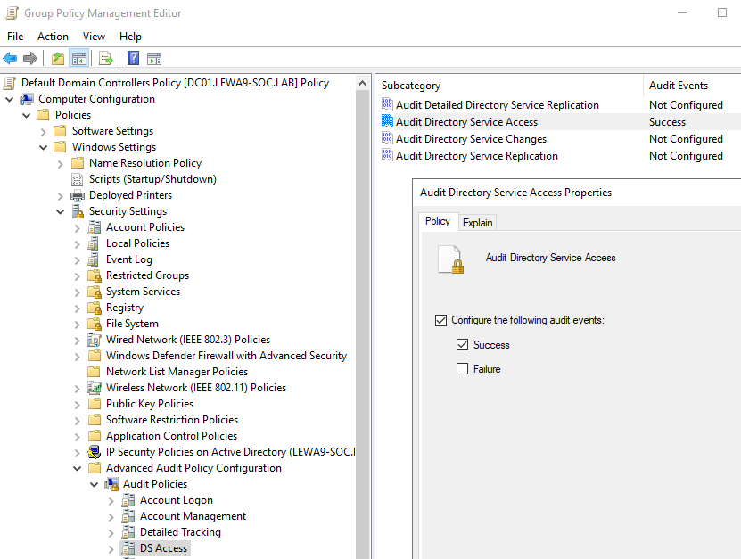

After this, we need to check connection between DC and Kali(that imitates bad guys actions).
From Kali we need ping DCs IP address, if you have your packets back, thats it. You can start attack simulation. 
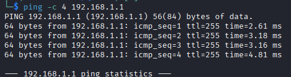
If you dont have your packets back, the Windows firewall on DC blocking them, you need to disable it by command 
`netsh advfirewall set allprofiles state off`
this command you need to type in `cmd` with Administrator rights.

I also encountered a problem where, even without the firewall blocking it, Kali couldnt reach port `389` where LDAP runs. This issue stemmed from the VirtualBox network configuration.
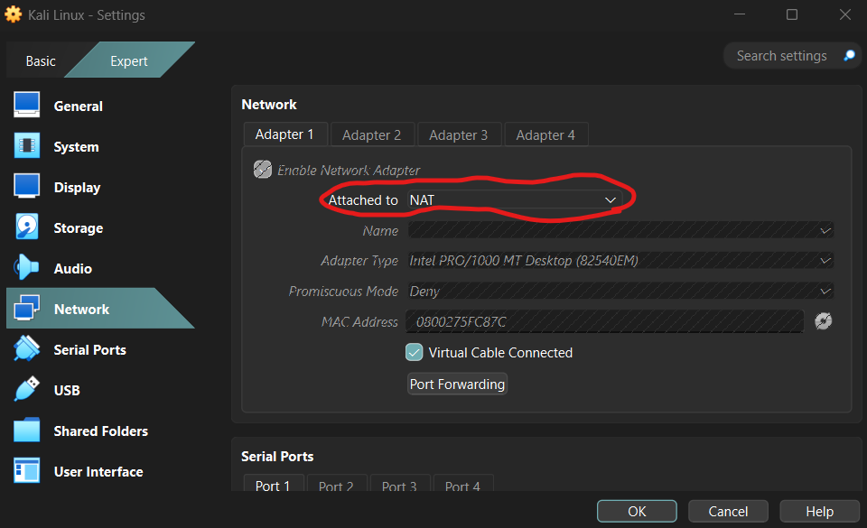
In the network setting of both virtual machines you must have same option, there are 2 main options.
- Bridged Adapter - where both machines have ip address from your home router.
- Virtual host Adapter(Host only Adapter/Internal Network) - where both machines have isolated connection (which I recommend for pure expirience).
like that :
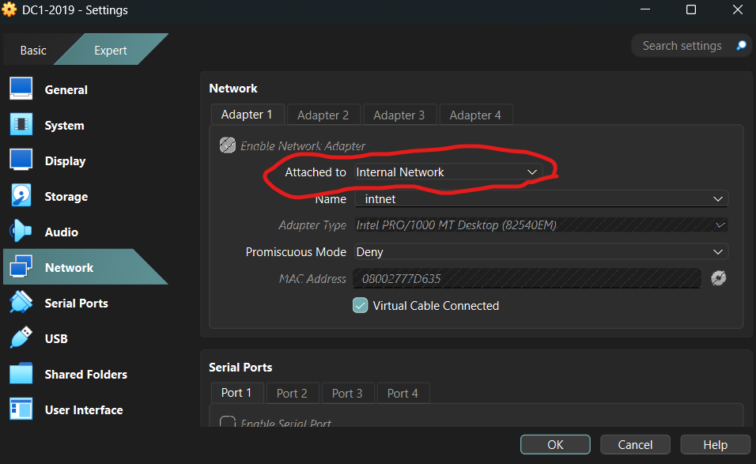
and
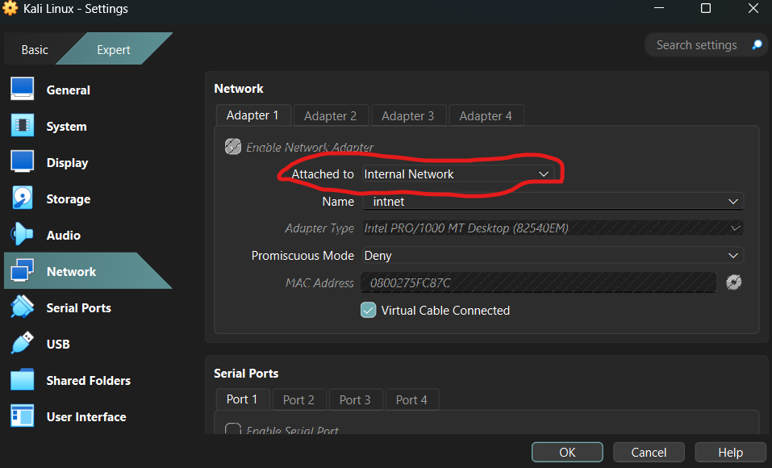
also then Kali need to be set on same ip address
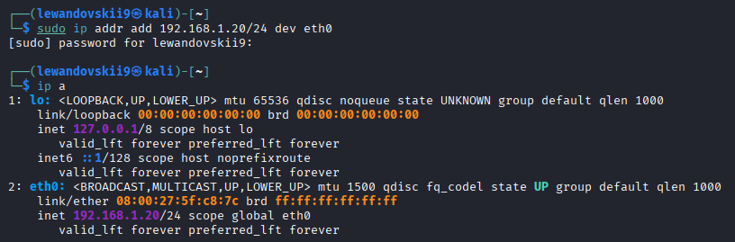
commands:
*But before you need to check what ethernet interface on your Kali, its usually eth0 but sometimes it can be difference.*
to set - `sudo ip addr add 192.168.1.20/24 dev eth0`
to check - `ip a`
### Attack simulation

From Kali, first of all attacker needs to discover the domain name. The following command finds the base naming contexts:

`ldapsearch -x -H ldap://YOUR-DOMAIN-IP -s base namingContexts` 

That command finds domain name.
Result:
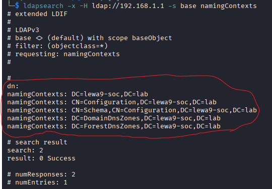

The final command to extract all DC users is:
`ldapsearch -x -H ldap://192.168.1.1 -D "ADMINISTRATOR-NAME" -W -b "DC=YOUR-LAB,DC=lab" "(objectClass=user)" sAMAccountName`

This simulates a scenario where an external attacker has gained persistence in the system and is initiating **Lateral Movement**.

Result:
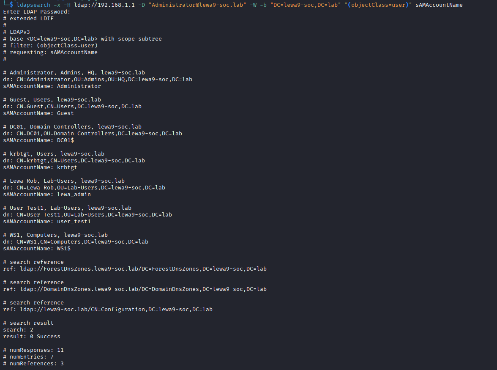

### SOC Log Analysis

Below is the XML view of the suspicious **Event ID 4662** captured on the Domain Controller.
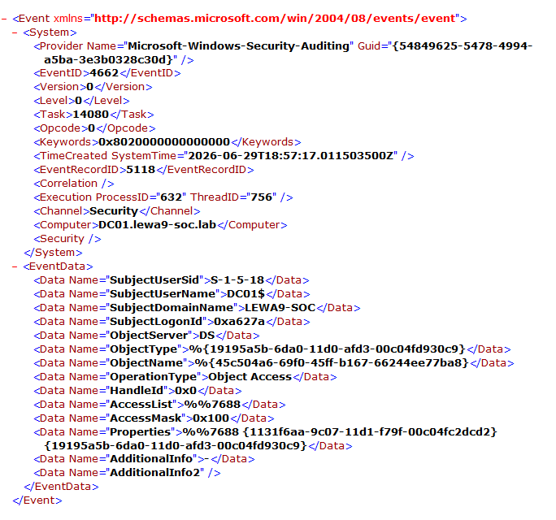

From this XML invesigation it is malicious actions because going request to all DC system(`AccessMask>0x100` it is Read property operation) its strong indicator for (Reconnaissance), because in that way automated tools like ldapsearch, using it to build network map.

#### IoCs :
1. ObjectType: %{19195a5b-6da0-11d0-afd3-00c04fd930c9}. From microsoft documentation it is domainDNS. Request goal was all DC system.
2. EventRecordID: 5118
3. Access Mask: 0x100

[Back to Top](#active-directory-attack--detection-lab)

---

## 2. Kerberoasting

### Pre-Attack Setup
Check audit policy to generate telemetry that we want investigate.
- Open `Group Policy Management` on your DC.
        
    - Verify **Audit Kerberos Service Ticket Operations** is set to **Success and Failure** (under `Computer Configuration` $\rightarrow$ `Policies` $\rightarrow$ `Windows Settings` $\rightarrow$ `Security Settings` $\rightarrow$ `Advanced Audit Policy Configuration` $\rightarrow$ `Account Logon`).

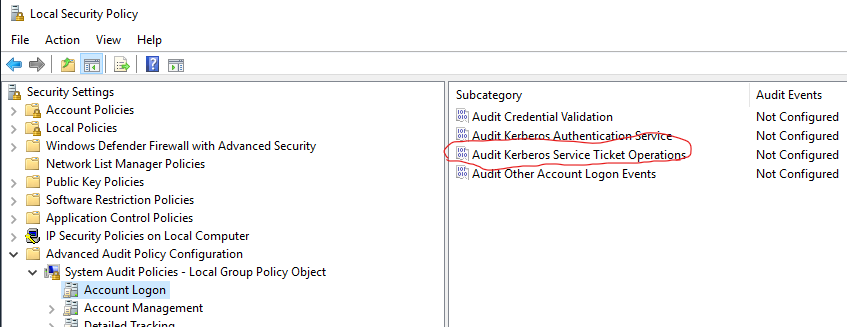

Must be turn like this:
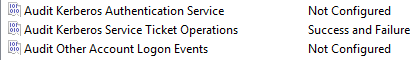

- **Target Account:** Create user with a Service Principal Name (SPN).
Use this command in PowerShell with admin rights

1. Creating user `sql_service`
`New-ADUser -Name "sql-service" -SamAccountName "sql-service" -UserPrincipalName "sql_service@lewa9-soc.lab" -AccountPassword(ConvertTo-SecureString "P@ssw0rd1234!" -AsPlainText -Force) -Enabled $true`

2. Setting SPN (Service Principal Name)
`setspn -A MSSQLSvc/sql01.lewa9-soc.lab:1433 sql_service`

(Change `lewa9-soc.lab` to your domain name).

Result (SPN registration verification):
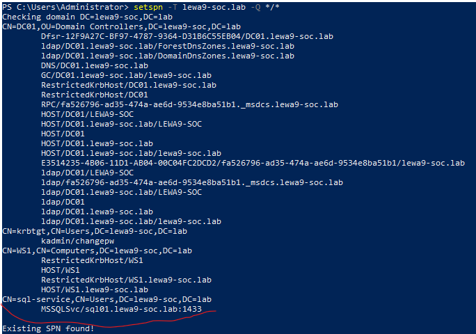

### Attack simulation
Simulated scenario where an adversary has already compromised valid domain user credentials.

By command - `impacket-GetUserSPNs lewa9-soc.lab/sql-service:'P@ssw0rd1234!' -dc-ip 192.168.1.1 -request`

Requesting hash-key for SPN
Result :
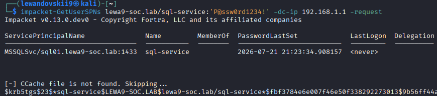

The adversary exfiltrates the TGS ticket hash for offline password cracking to reveal the service account password.

### SOC Log Analysis
**EventID 4769** XML-view:
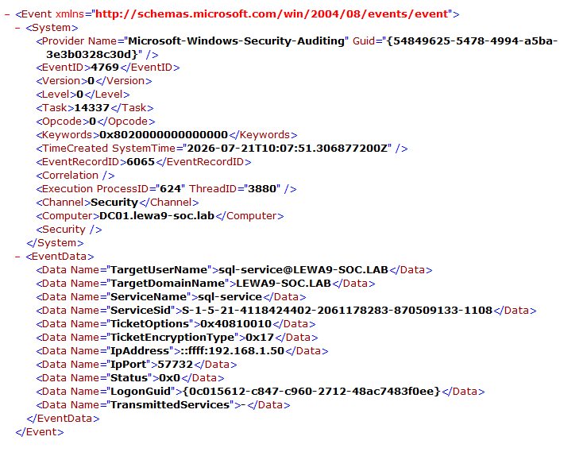

**Verdict** : True Positive. Detect requested Kerberos TGS ticket for sensitive service account `sql-service` using weak encryption algorithm (**RC4-HMAC / 0x17**). Request originated from suspicious host (`192.168.1.50`).

#### IoCs :

Network Indicators

| Type      | Value          |
| --------- | -------------- |
| Source IP | `192.168.1.50` |

Local Indicators

| Type                 | Value                       |
| -------------------- | --------------------------- |
| Target Account       | `sql-service@LEWA9-SOC.LAB` |
| Requested SPN        |  `sql-service`              |
| Encryption Downgrade | `0x17` (RC4)                |
| Event ID             | 4769                        |

#### Recommended Actions :

1. **Isolate** source host (`192.168.1.50`) from network.

2. **Change password** for `sql-service`
   
3. **Disable RC4 encryption** for Kerberos TGS requests.

[Back to Top](#active-directory-attack--detection-lab)

---

## 3. Pass-the-Hash

[Back to Top](#active-directory-attack--detection-lab)
